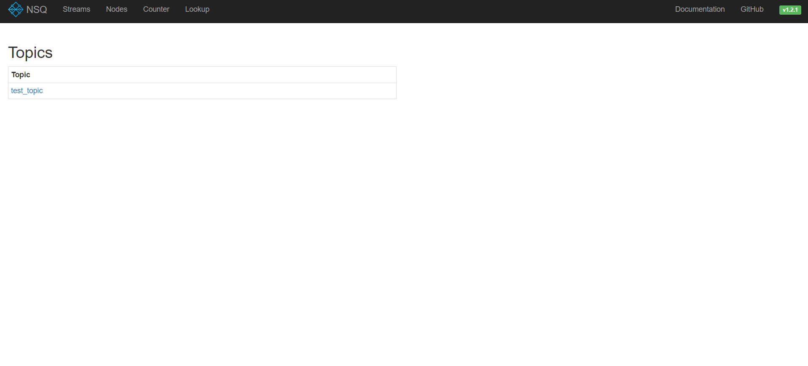
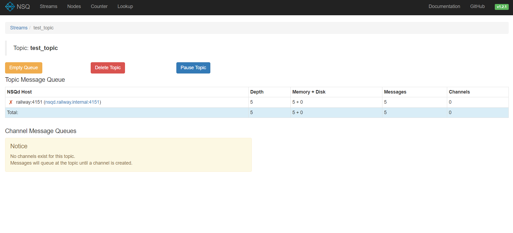
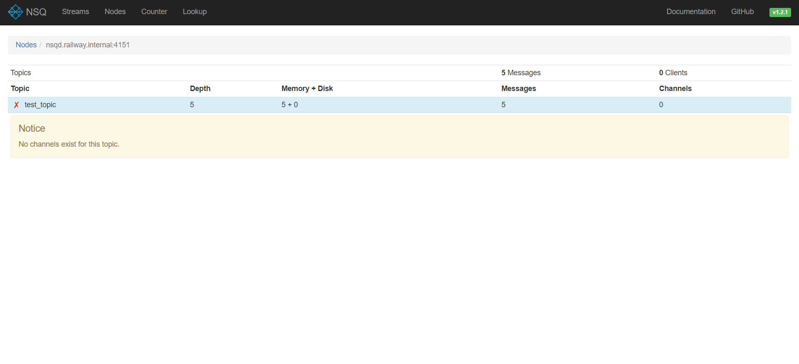
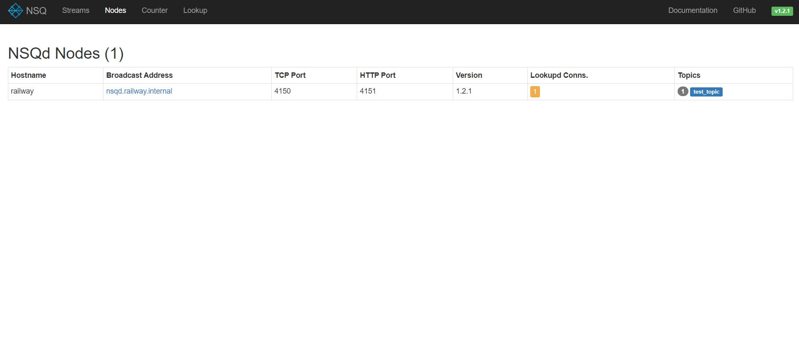
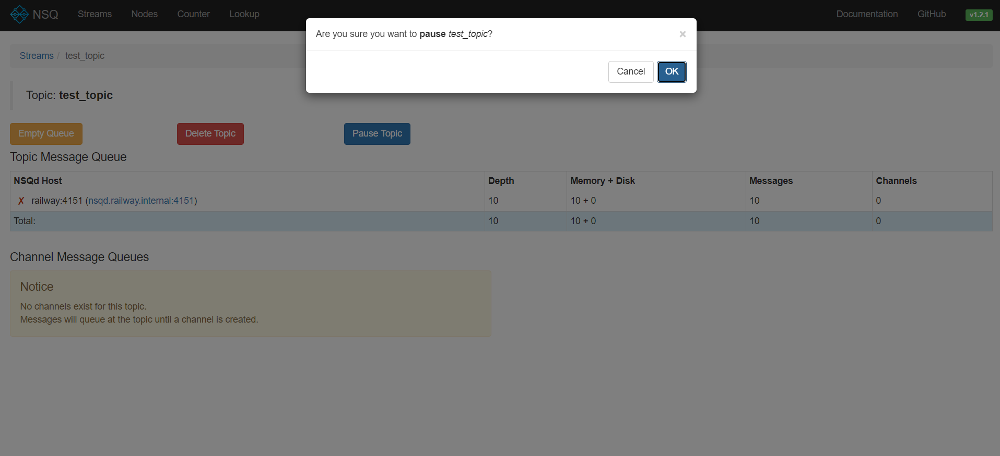

# NSQ - Railway Template

This example deploys a self-hosted version of [nsq](https://nsq.io/). NSQ is a realtime distributed messaging platform designed to operate at scale, handling billions of messages per day.

[](https://railway.app/template/okc9Wi?referralCode=HT4TtK)

## 🎓 What is NSQ?
NSQ is a realtime distributed messaging platform.

**Features**
* support distributed topologies with no SPOF
* horizontally scalable (no brokers, seamlessly add more nodes to the cluster)
* low-latency push based message delivery (performance)
* combination load-balanced and multicast style message routing
* excel at both streaming (high-throughput) and job oriented (low-throughput) workloads
* primarily in-memory (beyond a high-water mark messages are transparently kept on disk)
* runtime discovery service for consumers to find producers (nsqlookupd)
* transport layer security (TLS)
* data format agnostic
* few dependencies (easy to deploy) and a sane, bounded, default configuration
* simple TCP protocol supporting client libraries in any language
* HTTP interface for stats, admin actions, and producers (no client library needed to publish)
* integrates with statsd for realtime instrumentation
* robust cluster administration interface (nsqadmin)

## ✨ Services

- NSQ
- NSQ Admin
- NSQ Lookupd
- NGINX

## 💁‍♀️ How to use

- Click the Railway button 👆
- Add the required environment variables
- Deploy
- To Access NSQ Admin visit the URL from railway deployment for Nsqadmin service

- NSQ Admin Dashboard
    - NSQ Admin is a web UI to view aggregated cluster stats in realtime and perform various administrative tasks.
    - It can be used to view the state of the cluster, show metadata for topics and channels, show the message backlog for channels, force re-queued messages to be sent to clients, and show client connections.
    - To view the list of streams, click on streams
    
    - It shows list of NSQd nodes and their status
    - By Clicking on any node, it shows the list of topics and channels
    
    - To view list of producers, click on Nodes
    
    - NSQAdmin also provides feature to create new topic and channels in Lookup tab
    - You can also manage any topic and channel, by click on topic or channel name
    
    - NSQ has more features like TLS, Authorization, etc. which can be configured in config files
- NSQ Client Libraries
    - There are many officially support client libraries for NSQ. You can check the list here: https://nsq.io/clients/client_libraries.html
    - In this Repository under `examples/` folder there are python and node example files to demostrate and how to use NSQ queue system as beginner.
    - Known Issue: NSQ Subscription only works via TCP and HTTP, and currently Railway doesn't support TCP/HTTP exposure publicly but it will still work when you deploy a service internally within a project and access it.
    - You can perform basic operation like all CRUD using CURL or any tool to interact with HTTP protocol like POSTMAN.
    - [To create a new topic](https://nsq.io/components/nsqd.html#post-topiccreate)
        ```bash
        curl -X POSThttps://<PROJECT_NAME>.up.railway.app/topic/create?topic=name
        ``` 
    - [To create a new channel](https://nsq.io/components/nsqd.html#post-channelcreate)
        ```bash
        curl -X POST https://<PROJECT_NAME>.up.railway.app/channel/create?topic=name&channel=name
        ```
    - [To Get list of Topic or Channels](https://nsq.io/components/nsqlookupd.html#get-topics)
        ```bash
        curl -X GET https://<PROJECT_NAME>.up.railway.app/topics
        curl -X GET https://<PROJECT_NAME>.up.railway.app/channels?topic=name
        ```
    - To publish a message
        ```bash
        curl -d "test message" https://<PROJECT_NAME>.up.railway.app/pub?topic=name
        ```
    - There are more operations which can be performed using HTTP protocol, you can check the list here: https://nsq.io/components/nsqd.html#http-api
- Enjoy!

## 📝 Notes

- Source repo: https://github.com/nsqio/nsq
- Docs: https://nsq.io/overview/design.html